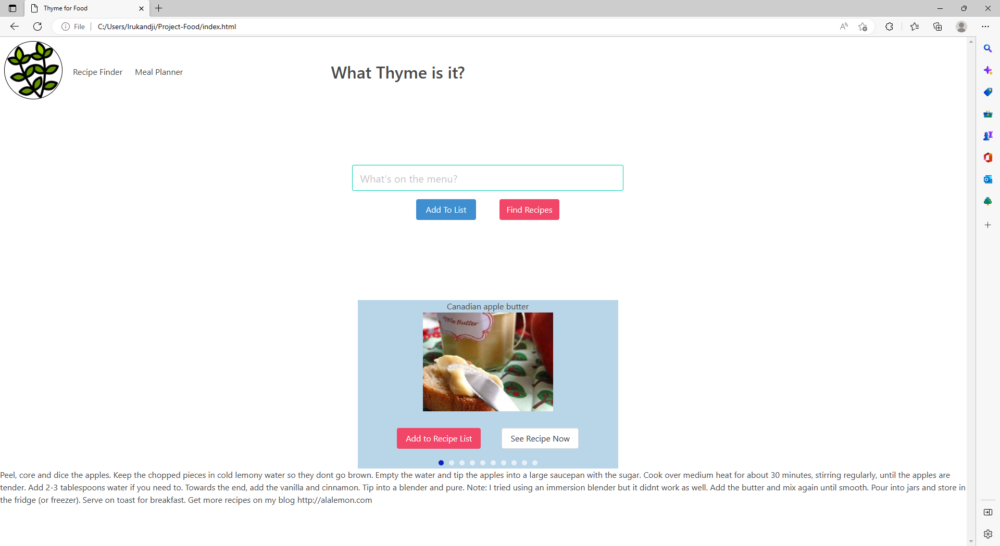
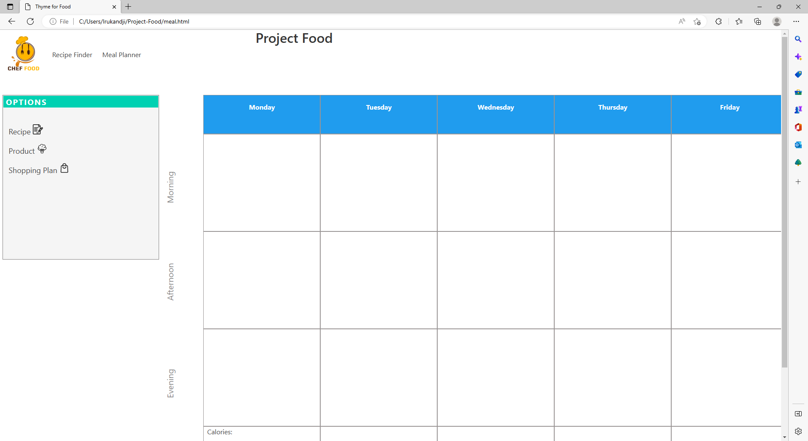

# What Thyme Is It?

This code is a basic recipe finder and meal planner web application. It is built using HTML, CSS, and JavaScript.

The application consists of three HTML pages:

The first page allows the user to input ingredients and search for recipes that can be made with those ingredients.

The second page displays the recipes in a carousel format and allows the user to save a recipe.

The third page is a meal planner that allows the user to view saved recipes and plan meals for the week.

## Screenshots

